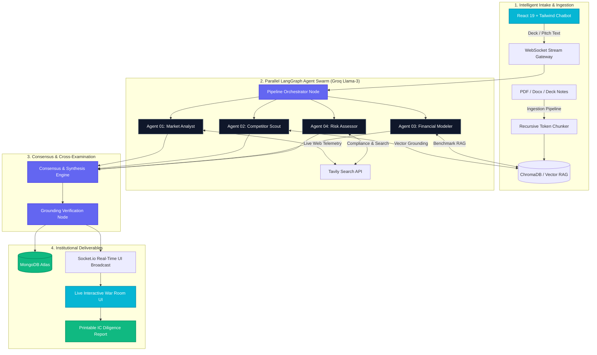

<div align="center">

# 🧭 PitchVane

### **Institutional-Grade Autonomous Multi-Agent Due Diligence Platform**

*Accelerate 3 weeks of venture analyst research into an 18-page, ground-truth investment committee memo in under 120 seconds.*

[](https://github.com/ayanpaul14/PitchVane/stargazers)
[](https://opensource.org/licenses/MIT)
[](https://nodejs.org)
[](https://react.dev)
[](https://vitejs.dev)
[](https://tailwindcss.com)
[](https://groq.com)
[](https://langchain.com)
[](https://mongodb.com)

[Explore Documentation](#-system-architecture) • [Quick Start](#-quick-start) • [Agent Swarm](#-autonomous-agent-swarm) • [API Reference](#-api-endpoints)

</div>

---

## ⚡ The PitchVane Thesis

Venture Capital partners review **hundreds of pitch decks a month**, but manual due diligence is bottlenecked:
- ❌ **Slow turnaround**: 2–3 weeks to thoroughly audit competitors, TAM, unit economics, and risk defensibility.
- ❌ **Hallucinated assumptions**: Founders inflate market projections and omit key incumbents.
- ❌ **Siloed analysis**: Financial modeling and operational risks are audited piecemeal without synthesized consensus.

**PitchVane fixes this.** It acts as an autonomous AI Due Diligence War Room. Using an orchestrated swarm of specialized LangGraph agents backed by real-time web telemetry and vector search, PitchVane stress-tests every claim, cross-examines findings in real time, and synthesizes a verifiable Investment Committee (IC) Dossier with grounded citations.

---

## 🏗️ System Architecture



---

## 🤖 Autonomous Agent Swarm

PitchVane decomposes startup analysis into 4 concurrent AI specialist nodes:

| Agent | Focus Area | Key Evaluation Dimensions | Grounding Protocol |
| :--- | :--- | :--- | :--- |
| **01 · Market Analyst** | Industry Size & Momentum | • Total Addressable Market (TAM)<br>• Compound Annual Growth Rate (CAGR)<br>• Customer Urgency & Willingness-to-Pay | Tavily Live Market Crawl + Vector Industry Benchmark |
| **02 · Competitor Scout** | Moat & Defensibility | • Direct Incumbents vs. Indirect Threat<br>• Switching Barriers & Workflow Lock-in<br>• Feature Parity & Pricing Power | Secondary Competitor Radar + Feature Comparison Matrix |
| **03 · Financial Modeler** | Unit Economics & Runway | • Gross Margin Sustainability (70%+)<br>• LTV / CAC Payback Velocity (<12 mo)<br>• Cash Burn & Capital Efficiency | SaaS Benchmark Index + Working Capital Formulas |
| **04 · Risk Assessor** | Regulatory & Downside Audit | • Legal & Data Sovereignty Compliance<br>• Key-Person & Execution Dependency<br>• Tech Stack Fragility & Vulnerabilities | Regulatory Compliance Framework + Downside Matrix |

---

## ✨ Key Platform Features

### 1. 💬 AI Diligence Copilot & Chatbot Intake
- Conversational chat input accepting raw startup notes, pitch text, or document uploads (`PDF`, `DOCX`, `PPTX`, `TXT`).
- 1-click curated demo cases (e.g. *CargoPulse Logistics*, *OmniHealth AI*) to test end-to-end pipelines instantly.
- Drag-and-drop feedback overlay with responsive mobile layouts.

### 2. ⚡ Real-Time Streaming War Room Telemetry
- Sub-second agent node updates streamed via **Socket.io**.
- Individual node activity trackers showing active search query steps, live confidence intervals, and vector citation hits.
- Live system status indicators monitoring engine health and socket connection states.

### 3. 🔍 Single-Tab Deep Dive & Interactive Agent Inspection
- Click any agent card to open a full-page specialized investigation tab.
- In-depth **3-dimension evaluation metrics** with ground-truth verification badges.
- Tab-switching navigation (`Previous` / `Next Agent`) without losing state or context.

### 4. 📊 Reconciled Investment Committee (IC) Dossier
- Synthesized consensus score (0–100) and recommendation tags: `PROCEED TO IC`, `CONDITIONAL PASS`, or `HIGH RISK / PASS`.
- Interactive Key Debate Points detailing bear vs. bull counter-arguments.
- Complete audit trail of verified grounding citations.

### 5. 📄 1-Click Printable / Exportable Memo
- Fully formatted, print-optimized stylesheet ready for PDF export.
- Clean page breaks, corporate venture formatting, executive summaries, agent matrix, and signatory blocks.

### 6. 📱 Responsive & Adaptive Dark/Light Aesthetics
- Custom HSL palette crafted with ultra-dark mode (`#060b19`), glassmorphism, subtle micro-animations, and vibrant accents.
- Mobile-first responsive architecture tested down to 380px viewports.

---

## 📂 Project Structure

```text
PitchVane/
├── backend/
│   ├── agents/                   # LangGraph AI Specialist Agents
│   │   ├── marketAnalyst.js      # Agent 01: TAM & Industry size
│   │   ├── competitorScout.js    # Agent 02: Moat & Incumbents
│   │   ├── financialModeler.js   # Agent 03: Unit Economics
│   │   ├── riskAssessor.js       # Agent 04: Downside & Regulatory
│   │   ├── synthesizer.js        # Consensus & IC recommendation
│   │   ├── verifyGrounding.js    # Citation verification & anti-hallucination
│   │   └── schema.js             # Structured output schemas
│   ├── config/                   # Database (Mongoose) & AI Model configs
│   ├── graph/                    # LangGraph orchestration state machine
│   ├── middleware/               # JWT authentication middleware
│   ├── models/                   # Case & User schemas (MongoDB Atlas)
│   ├── rag/                      # Tavily live web retrieval & vector search
│   ├── routes/                   # REST API routes (/api/cases, /api/auth)
│   └── server.js                 # Express server & Socket.io gateway
│
├── frontend/
│   ├── src/
│   │   ├── components/           # Reusable UI components
│   │   │   ├── AgentCard.jsx     # Responsive agent card component
│   │   │   ├── AgentGrid.jsx     # 4-Agent grid & single tab expansion
│   │   │   ├── CaseIntakeForm.jsx# Interactive chatbot intake
│   │   │   ├── DossierView.jsx   # Reconciled dossier & debate points
│   │   │   ├── PrintableReport.jsx# Clean PDF export template
│   │   │   ├── Header.jsx        # Navigation & auth modal trigger
│   │   │   └── HeroSection.jsx   # Landing page hero with 3D shader
│   │   ├── context/              # Auth & Theme context providers
│   │   ├── hooks/                # useCaseSocket for streaming telemetry
│   │   ├── views/                # Full views (WarRoom, Dossiers, Profile, Docs)
│   │   ├── App.jsx               # Main router & layout coordinator
│   │   └── index.css             # Tailwind v4 theme & custom utilities
│   └── package.json
│
├── ingestion/                    # Vector RAG pre-processing
│   ├── loadDocs.js               # Raw pitch documents loader
│   ├── chunk.js                  # Token-aware text chunking
│   └── pushToChroma.js           # ChromaDB embeddings ingestion
│
├── .gitignore                    # Comprehensive secrets & build ignores
├── README.md                     # Project documentation
└── pitchvane_system_design.md   # Architectural specifications
```

---

## 🚀 Quick Start

### 1. Prerequisites
- **Node.js** v18.0 or higher
- **npm** or **pnpm**
- **MongoDB Atlas** cluster URI (or local MongoDB)
- **Groq API Key** ([console.groq.com](https://console.groq.com))
- **Tavily API Key** ([tavily.com](https://tavily.com))

---

### 2. Backend Installation

```bash
# Navigate to backend
cd backend

# Install dependencies
npm install

# Configure environment variables
cp .env.example .env
```

Open `backend/.env` and provide your credentials:
```env
GROQ_API_KEY=gsk_your_groq_api_key_here
TAVILY_API_KEY=tvly_your_tavily_api_key_here
MONGODB_URI=mongodb+srv://<user>:<password>@cluster.mongodb.net/pitchvane
JWT_SECRET=your_jwt_secret_key_here
```

Launch the backend server:
```bash
npm run dev
# Backend running on http://localhost:5000 (Socket.io ready)
```

---

### 3. Frontend Installation

```bash
# Open a new terminal and navigate to frontend
cd frontend

# Install dependencies
npm install

# Configure environment variables
cp .env.example .env
```

Open `frontend/.env`:
```env
VITE_GOOGLE_CLIENT_ID=your_google_oauth_client_id
VITE_GOOGLE_CLIENT_SECRET=your_google_oauth_client_secret
```

Launch the Vite development server:
```bash
npm run dev
# Frontend running on http://localhost:5173
```

Open **`http://localhost:5173`** in your browser to enter the War Room.

---

## 📡 API Endpoints

| Method | Endpoint | Description | Protected |
| :--- | :--- | :--- | :---: |
| `POST` | `/api/cases/analyze` | Initiates 4-agent parallel pipeline for a pitch | No |
| `GET` | `/api/cases` | Retrieves historical analysis cases | Yes (JWT) |
| `GET` | `/api/cases/:id` | Fetches complete dossier by case ID | No |
| `GET` | `/api/cases/stats` | Returns aggregate diligence telemetry stats | Yes (JWT) |
| `POST` | `/api/auth/register` | Register new analyst account | No |
| `POST` | `/api/auth/login` | Login and receive bearer JWT | No |
| `POST` | `/api/auth/google` | Google OAuth token verification & auth | No |

---

## 🧪 Testing & Validation

```bash
# Verify frontend production build
cd frontend
npm run build

# Run lint checks
npm run lint
```

---

## 🛡️ Security & Privacy

- **Zero Secret Exposure**: `.gitignore` strictly excludes all active `.env` files and certificates.
- **Stateless Agent Inference**: Pitch data is ingested per session; vector chunks can be scrubbed post-synthesis.
- **Enterprise RBAC**: Role-based access control (GP, Managing Partner, Principal, Associate) on sensitive case dossiers.

---

## 🤝 Contributing

Contributions to PitchVane are welcome! To contribute:

1. Fork the Project
2. Create your Feature Branch (`git checkout -b feature/AmazingFeature`)
3. Commit your Changes (`git commit -m 'Add some AmazingFeature'`)
4. Push to the Branch (`git push origin feature/AmazingFeature`)
5. Open a Pull Request

---

## 📜 License

Distributed under the **MIT License**. See `LICENSE` for more information.

---

<div align="center">
  <b>Built for Venture Capitalists, Angel Syndicates, and Forward-Thinking Founders.</b><br>
  <sub>Crafted with ❤️ by <a href="https://github.com/ayanpaul14">Ayan Paul</a></sub>
</div>
